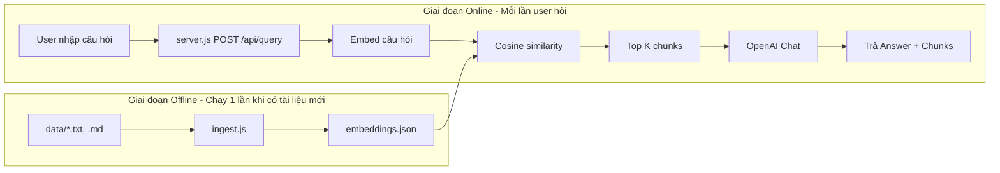

# Cách hoạt động của hệ thống RAG Web Demo

Tài liệu mô tả chi tiết từng file, từng đoạn code và luồng dữ liệu trong hệ thống RAG (Retrieval Augmented Generation).

---

## 1. Tổng quan luồng hệ thống

- **Offline:** Tài liệu trong `data/` được đọc → cắt chunk → embed bằng Hugging Face → lưu vào `embeddings.json`.
- **Online:** User gửi câu hỏi → server embed câu hỏi → so sánh với từng chunk trong `embeddings.json` → lấy top K chunk liên quan nhất → gửi context + câu hỏi cho OpenAI → trả về answer và danh sách chunks.

---

## 2. Cấu trúc thư mục và vai trò từng file

| Đường dẫn | Vai trò |
|-----------|--------|
| **package.json** | Khai báo dependency (express, openai, axios, dotenv) và scripts: `npm start` (chạy server), `npm run ingest` (chạy ingestion). |
| **.env** | Biến môi trường bí mật: `HUGGINGFACE_TOKEN`, `OPENAI_API_KEY`. Không commit lên git. |
| **.env.example** | Mẫu để người khác biết cần set biến gì (không chứa giá trị thật). |
| **data/** | Thư mục chứa tài liệu nguồn. Chỉ đọc file `.txt` và `.md`. Mọi file khác bị bỏ qua. |
| **embeddings.json** | Do `ingest.js` tạo ra. Mảng các object `{ id, text, embedding, sourceFile }`. Dùng làm “kho” để retrieval so sánh với câu hỏi. |
| **utils.js** | Hàm dùng chung: cosine similarity và gọi Hugging Face API lấy embedding (1 đoạn hoặc nhiều đoạn). |
| **ingest.js** | Script chạy bằng tay: đọc `data/`, chunk, gọi HF embed, ghi `embeddings.json`. |
| **server.js** | Ứng dụng Express: serve file tĩnh trong `public/` và xử lý `POST /api/query` (retrieval + LLM). |
| **public/index.html** | Giao diện web: form nhập câu hỏi, nút Submit, khu vực hiển thị “Retrieved chunks” và “Answer”. |
| **public/style.css** | Style cho trang: layout, form, thẻ chunk, ô answer. |

---

## 3. Chi tiết từng file

### 3.1. `package.json`

- **name, version, description:** Metadata của project.
- **scripts.start:** `node server.js` — khởi động server web.
- **scripts.ingest:** `node ingest.js` — chạy bước index tài liệu (chunk + embed).
- **dependencies:**
  - `express`: HTTP server, route, middleware.
  - `openai`: Gọi OpenAI Chat API để sinh câu trả lời từ context.
  - `axios`: Gửi HTTP request tới Hugging Face API (embedding).
  - `dotenv`: Đọc file `.env` vào `process.env`.

---

### 3.2. `utils.js`

File này cung cấp hàm dùng chung cho **embedding** và **tính độ tương đồng**.

#### 3.2.1. Hằng số / URL

- **HF_API_BASE, HF_EMBED_MODEL, HF_API_URL:** Cấu hình endpoint Hugging Face để gọi embedding (model `sentence-transformers/all-MiniLM-L6-v2`). `utils` dùng URL router HF (feature-extraction pipeline).
- **proxy: false:** Bắt axios không đi qua proxy hệ thống (tránh lỗi ETIMEDOUT khi máy cấu hình proxy).

#### 3.2.2. `cosineSimilarity(a, b)`

- **Mục đích:** Tính độ tương đồng giữa hai vector (embedding của câu hỏi và của chunk). Giá trị từ -1 đến 1; càng gần 1 càng “giống” (semantic).
- **Công thức:** `dot(a,b) / (||a|| * ||b||)`. Không dùng thư viện ngoài, tự tính dot product và norm.
- **Dùng ở đâu:** Trong `server.js`, so sánh `queryEmbedding` với `entry.embedding` của từng chunk trong `embeddings.json`.

#### 3.2.3. `getEmbeddingHF(text, apiKey)`

- **Mục đích:** Gửi **một đoạn văn** lên Hugging Face, nhận về **mảng số** (embedding vector).
- **Tham số:** `text` (string), `apiKey` (HUGGINGFACE_TOKEN).
- **Cách dùng:** Gọi `axios.post(HF_API_URL, { inputs: text }, { headers: Authorization, timeout, proxy: false })`. `res.data` là mảng embedding (hoặc format HF trả về), được return trực tiếp.
- **Dùng ở đâu:** Trong `server.js` khi embed **câu hỏi** của user.

#### 3.2.4. `getEmbeddingsHF(texts, apiKey)`

- **Mục đích:** Gửi **nhiều đoạn văn** trong một request (batch), nhận về mảng các embedding.
- **Tham số:** `texts` (mảng string hoặc 1 string), `apiKey`.
- **Cách dùng:** Cùng endpoint với `getEmbeddingHF`, body `{ inputs: texts }`. HF trả về mảng embedding tương ứng từng phần tử.
- **Dùng ở đâu:** Trong `ingest.js` khi embed từng batch chunk (giảm số lần gọi API).

---

### 3.3. `ingest.js`

Script chạy **một lần** (hoặc mỗi khi thêm/sửa tài liệu trong `data/`). Nó đọc file → cắt chunk → embed → ghi `embeddings.json`.

#### 3.3.1. Load env và đường dẫn

- `require('dotenv').config()`: Nạp `.env` vào `process.env` (để dùng `HUGGINGFACE_TOKEN`).
- `DATA_DIR`: Thư mục `data/` (chứa .txt, .md).
- `EMBEDDINGS_PATH`: Đường dẫn file `embeddings.json` (cùng thư mục với project).

#### 3.3.2. Hằng số chunking và batch

- **CHUNK_SIZE = 300:** Mỗi chunk mục tiêu ~300 ký tự (đoạn nhỏ, dễ trúng nội dung cần hỏi).
- **CHUNK_OVERLAP = 50:** Khi cắt theo kích thước, đoạn sau overlap 50 ký tự với đoạn trước để tránh cắt đứt giữa câu.
- **SECTION_SPLIT:** Regex `\n(?=\d+\.\s|Mục\s*\d+|\s*##\s)` — tách theo **đầu section** (số thứ tự "1. ", "2. ", hoặc "Mục 1", hoặc "## "). Mục đích: ưu tiên mỗi mục thành một khối, sau đó mới cắt nhỏ theo kích thước nếu section dài.
- **BATCH_SIZE = 5:** Gửi tối đa 5 chunk/lần lên Hugging Face (tránh rate limit free tier).

#### 3.3.3. Hàm `chunkText(text)`

- **Đầu vào:** Toàn bộ nội dung một file (string).
- **Bước 1:** `text.split(SECTION_SPLIT)` → tách thành các “section” (theo số thứ tự / Mục N / ##). Nếu không tách được (ít hơn 2 phần) thì coi cả file là một “section”.
- **Bước 2:** Với mỗi section:
  - Nếu độ dài ≤ CHUNK_SIZE → giữ nguyên section làm 1 chunk.
  - Nếu dài hơn → cắt từng đoạn CHUNK_SIZE, ưu tiên cắt ở `\n\n`, `. `, hoặc space (≥ 60 ký tự) để không cắt giữa từ. Overlap CHUNK_OVERLAP giữa hai đoạn liên tiếp.
- **Đầu ra:** Mảng các string (các chunk).

#### 3.3.4. Hàm `main()` — luồng chính

1. **Kiểm tra HUGGINGFACE_TOKEN:** Thiếu thì báo lỗi và thoát.
2. **Đọc danh sách file:** `fs.readdirSync(DATA_DIR)`, lọc chỉ lấy file có đuôi `.txt` hoặc `.md`.
3. **Chunk từng file:** Với mỗi file, đọc nội dung → gọi `chunkText(content)` → với mỗi chunk, push vào `allEntries` một object `{ id, text, sourceFile, embedding: null }`. `id` tăng dần toàn cục.
4. **Embed từng batch:** Vòng lặp theo batch BATCH_SIZE; mỗi batch gọi `getEmbeddingsHF(texts, apiKey)`; gán `batch[j].embedding = vectors[j]`.
5. **Ghi embeddings.json:** Map `allEntries` thành mảng `{ id, text, embedding, sourceFile }` và `fs.writeFileSync(EMBEDDINGS_PATH, ...)`.

Kết quả: File `embeddings.json` chứa toàn bộ chunk đã embed, dùng cho bước retrieval ở server.

---

### 3.4. `server.js`

Ứng dụng Express: phục vụ giao diện và API truy vấn RAG.

#### 3.4.1. Khởi tạo và middleware

- `require('dotenv').config()`: Nạp `.env`.
- `express.json()`: Parse body JSON của request (để đọc `req.body.question`).
- `express.static('public')`: Serve file tĩnh (index.html, style.css) khi user mở `/`.
- `EMBEDDINGS_PATH`: Đường dẫn `embeddings.json`.
- `CHAT_MODEL`: Model OpenAI dùng để trả lời (vd: gpt-4o-mini).
- `TOP_K`: Số chunk tối đa đưa vào context (vd: 3).
- `SIMILARITY_THRESHOLD`: Chỉ giữ chunk có similarity > ngưỡng này (vd: 0.75), giảm nhiễu.
- `NOT_AVAILABLE_MSG`: Câu trả lời cố định khi thông tin không có trong tài liệu.

#### 3.4.2. `loadEmbeddings()`

- Đọc file `embeddings.json`, parse JSON, trả về mảng các `{ id, text, embedding, sourceFile }`.
- Gọi mỗi khi xử lý `/api/query` (hoặc có thể cache tùy cách bạn sửa sau).

#### 3.4.3. `POST /api/query` — từng bước

**Bước 1 – Kiểm tra input và token**

- Kiểm tra `HUGGINGFACE_TOKEN` (dùng để embed câu hỏi). Thiếu → 500.
- Lấy `question` từ `req.body`. Thiếu hoặc không phải string → 400.

**Bước 2 – Load embeddings và embed câu hỏi**

- Gọi `loadEmbeddings()` → danh sách chunk đã embed.
- Gọi `getEmbeddingHF(question.trim(), hfToken)` → `queryEmbedding` (vector).

**Bước 3 – Retrieval (similarity + filter + top-k)**

- Với mỗi entry trong embeddings: tính `similarity = cosineSimilarity(queryEmbedding, entry.embedding)`, tạo object `{ ...entry, similarity }`.
- Sort giảm dần theo `similarity`.
- Lọc chỉ giữ entry có `similarity > SIMILARITY_THRESHOLD`.
- Nếu sau lọc còn ít nhất 1 phần tử: lấy tối đa TOP_K phần tử → `topChunks`. Nếu không còn phần tử nào (tất cả dưới threshold): fallback lấy 1 chunk có similarity cao nhất → `topChunks`.

**Bước 4 – Chuẩn bị payload chunks cho client**

- `chunksPayload`: map `topChunks` thành `{ text, sourceFile, similarity }` (làm tròn similarity), để gửi về UI (hiển thị “Retrieved chunks”).

**Bước 5 – Sinh câu trả lời (OpenAI)**

- Nếu không có `OPENAI_API_KEY`: trả về luôn với `chunksPayload` và answer là thông báo “chưa cấu hình API key”.
- Nếu có key: nối nội dung `topChunks` thành một chuỗi `context`, soạn:
  - **systemPrompt:** Bảo LLM chỉ dùng nội dung trong các đoạn; nếu không có thông tin thì trả lời đúng câu `NOT_AVAILABLE_MSG`; không dùng kiến thức bên ngoài.
  - **userMessage:** “Các đoạn tài liệu: … Câu hỏi: …”
- Gọi `openai.chat.completions.create` với model, system + user message, temperature thấp (0.2). Lấy `answer` từ `choices[0].message.content`.
- Nếu gọi OpenAI lỗi (vd: 429 quota): bắt lỗi, set `answer` thành thông báo thân thiện (vd: “quota exceeded, xem các chunk phía trên”) thay vì crash. Vẫn trả về `chunksPayload` + `answer`.

**Bước 6 – Response**

- Luôn trả JSON: `{ chunks: chunksPayload, answer }`. Front-end dùng để hiển thị “Retrieved chunks” và “Answer”.

---

### 3.5. `public/index.html`

- **Cấu trúc:** Form có textarea (question), nút Submit; vùng ẩn cho loading, lỗi; section kết quả gồm “Retrieved chunks” (danh sách thẻ) và “Answer”.
- **Script:**
  - Khi submit form: `preventDefault`, lấy `question`, gửi `POST /api/query` với body `JSON.stringify({ question })`.
  - Trong lúc chờ: disable nút, hiện “Loading…”, ẩn kết quả cũ.
  - Khi có response: nếu ok thì render từng chunk (sourceFile, similarity, text) vào `#chunks`, ghi `data.answer` vào `#answer`, hiện section kết quả. Nếu lỗi thì hiện message trong `#error`.
  - `escapeHtml`: escape nội dung chunk/answer khi gán vào DOM để tránh XSS.

---

### 3.6. `public/style.css`

- Style cho layout (container, font, màu nền), form (label, textarea, nút), loading/error, section “Retrieved chunks” (thẻ chunk), và ô “Answer”. Không chứa logic, chỉ giao diện.

---

## 4. Luồng dữ liệu tóm tắt

1. **Chuẩn bị:** Đặt file .txt/.md vào `data/`, cấu hình `.env` (HUGGINGFACE_TOKEN, OPENAI_API_KEY).
2. **Ingest:** Chạy `npm run ingest` → đọc `data/` → chunk (theo section + kích thước 300, overlap 50) → embed qua Hugging Face → ghi `embeddings.json`.
3. **Chạy server:** `npm start` → Express lắng nghe port (vd 3000), serve `public/` và API.
4. **User hỏi:** Mở trang, nhập câu hỏi, Submit → front-end gửi POST `/api/query` với `{ question }`.
5. **Server xử lý:** Load embeddings → embed câu hỏi (HF) → tính similarity với từng chunk → lọc theo threshold → lấy top K → gọi OpenAI với context + câu hỏi → trả `{ chunks, answer }`.
6. **Hiển thị:** Trang hiển thị danh sách chunks (file nguồn, similarity, nội dung) và câu trả lời (hoặc thông báo lỗi/quota).

---

## 5. Biến môi trường (.env)

| Biến | Dùng ở đâu | Mục đích |
|------|------------|----------|
| **HUGGINGFACE_TOKEN** | ingest.js, server.js (qua utils) | Gửi kèm header Authorization khi gọi Hugging Face API (embedding). |
| **OPENAI_API_KEY** | server.js | Gọi OpenAI Chat API để sinh câu trả lời từ context. |

---

## 6. Các tham số có thể chỉnh

- **ingest.js:** `CHUNK_SIZE`, `CHUNK_OVERLAP`, `SECTION_SPLIT`, `BATCH_SIZE` — ảnh hưởng độ mịn chunk và tốc độ/giới hạn API.
- **server.js:** `TOP_K`, `SIMILARITY_THRESHOLD`, `CHAT_MODEL`, `NOT_AVAILABLE_MSG`, nội dung system/user prompt — ảnh hưởng số chunk đưa vào LLM, độ nhiễu, và cách trả lời “không có trong tài liệu”.

File này mô tả đúng cách hệ thống hoạt động; khi sửa code, cập nhật lại SYSTEM.md cho khớp (vd: đổi URL HF trong utils, đổi threshold trong server).
